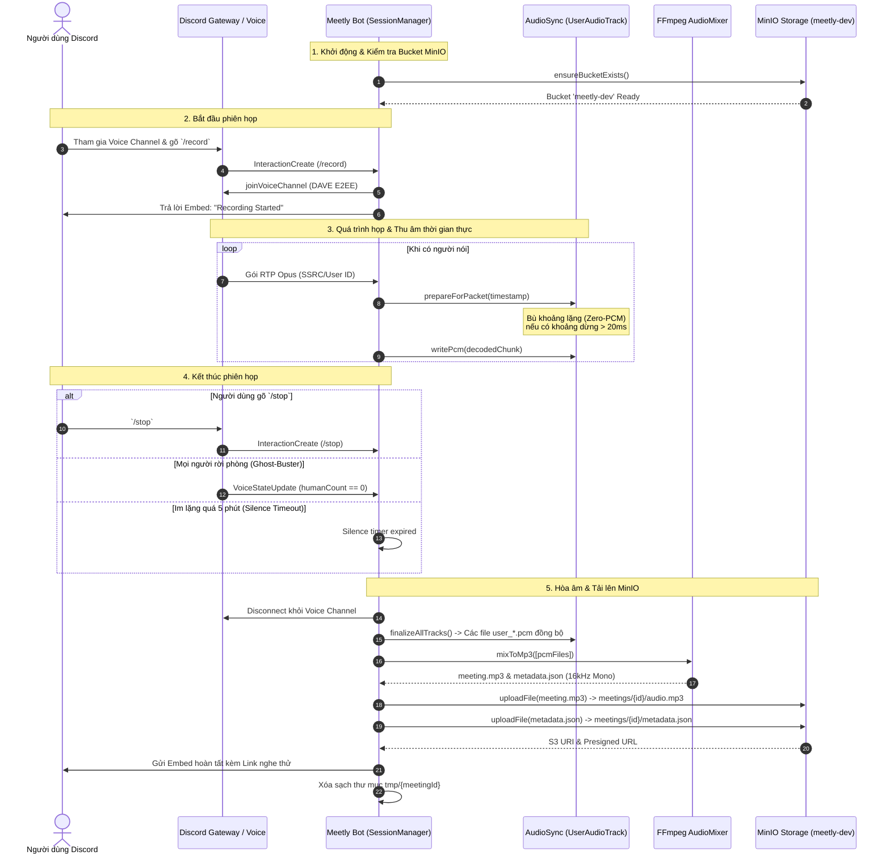

# Kiến Trúc & Quy Trình Hoạt Động (Architecture & Workflow)
### Meetly Discord Audio Extractor & MinIO Ingestion Engine

Tài liệu này tổng hợp toàn bộ cấu trúc hệ thống, quy trình trích xuất âm thanh từ Discord Voice Channel, cơ chế bù khoảng lặng chống lệch pha và quy trình nạp trực tiếp vào MinIO Object Storage.

---

## 1. Tổng Quan Hệ Thống (System Overview)

Dịch vụ `discord-bot` là một thành phần **hoàn toàn độc lập (Decoupled)** trong hệ sinh thái Meetly. Nhiệm vụ duy nhất của dịch vụ này là:
1. Tham gia vào bất kỳ kênh thoại (Voice Channel) nào trên Discord khi được kích hoạt.
2. Thu nhận, giải mã luồng âm thanh từng người nói theo thời gian thực (hỗ trợ mã hóa đầu cuối **DAVE Protocol**).
3. Tự động bù đệm khoảng lặng (Silence Padding) để các track của mọi người nói khớp nhau 100% về mặt thời gian.
4. Hòa âm qua **FFmpeg** thành tệp **16kHz Mono MP3** tối ưu cho AI.
5. Tải trực tiếp tệp âm thanh và tệp metadata chứa thông tin người nói vào **MinIO Bucket** (`meetly-dev`).

```
┌─────────────────────────────────────────────────────────────┐
│                 Discord Voice Channel                       │
│        (User A, User B, User C trên mọi nền tảng)           │
└──────────────────────────────┬──────────────────────────────┘
                               │ RTP Opus Packets (DAVE E2EE)
                               ▼
┌─────────────────────────────────────────────────────────────┐
│                 apps/discord-bot (Node.js)                  │
│                                                             │
│   1. VoiceReceiverManager: Bắt gói tin theo SSRC/User ID   │
│   2. UserAudioTrack: Silence Padding chống lệch timeline     │
│   3. AudioMixer: Hòa âm FFmpeg -> 16kHz Mono MP3           │
│   4. MinioStorageClient: Đẩy file lên S3 / MinIO            │
└──────────────────────────────┬──────────────────────────────┘
                               │ S3 PutObject (HTTPS / TLS)
                               ▼
┌─────────────────────────────────────────────────────────────┐
│            MinIO Object Storage (meetly-dev)                │
│    - meetings/{meetingId}/audio.mp3                         │
│    - meetings/{meetingId}/metadata.json                     │
└─────────────────────────────────────────────────────────────┘
```

---

## 2. Chi Tiết Các Thành Phần Lõi (Core Components)

Cấu trúc thư mục mã nguồn tại [`apps/discord-bot/src/`](file:///home/phuqy/Develop/meetly/apps/discord-bot/src):

```
apps/discord-bot/src/
├── config.ts                  # Nạp cấu hình, chuẩn hóa URL, tự động bật SSL/HTTPS
├── index.ts                   # Gateway Client, xử lý sự kiện Discord & Ghost-Buster
├── register-commands.ts       # Đăng ký Slash Commands (/record, /stop, /status)
├── commands/
│   ├── record.ts              # Lệnh bắt đầu ghi âm phòng họp
│   ├── stop.ts                # Lệnh kết thúc, xuất MP3 & đẩy lên MinIO
│   └── status.ts              # Lệnh kiểm tra trạng thái phòng họp đang ghi
├── core/
│   ├── audio-sync.ts          # Module chống lệch pha thời gian (UserAudioTrack)
│   ├── audio-mixer.ts         # Wrapper FFmpeg (hòa âm amix & xuất metadata)
│   ├── voice-receiver.ts      # Quản lý luồng âm thanh & DAVE Protocol
│   └── session-manager.ts     # Quản lý vòng đời phiên họp & cơ chế an toàn
└── storage/
    └── minio-client.ts        # Client MinIO S3 SDK (kiểm tra bucket, upload, presigned URL)
```

### 2.1. `src/config.ts` (Quản lý cấu hình)
- Tự động nạp cấu hình từ `.env` cục bộ hoặc `.env` ở root folder.
- Linh hoạt ánh xạ:
  - `MINIO_ROOT_USER` hoặc `MINIO_ACCESS_KEY` $\rightarrow$ Access Key.
  - `MINIO_ROOT_PASSWORD` hoặc `MINIO_SECRET_KEY` $\rightarrow$ Secret Key.
  - `DEFAULT_BUCKET` hoặc `MINIO_BUCKET` $\rightarrow$ Target Bucket (`meetly-dev`).
- Tự động nhận diện giao thức `https://` để kích hoạt mã hóa TLS.

### 2.2. `src/core/audio-sync.ts` (Chống lệch pha & đệm khoảng lặng)
- **Vấn đề**: Discord chỉ truyền dữ liệu khi có người nói. Nếu người A nói lúc 0:00 và người B nói lúc 5:00, nếu ghi thành file thô rồi ghép lại thì giọng người B sẽ bị đẩy về phút 0:00 đè lên người A.
- **Giải pháp**: Lớp `UserAudioTrack` ghi nhận mốc thời gian bắt đầu cuộc họp (`sessionStartTime`). Mỗi khi có gói âm thanh mới đến, nếu có khoảng cách im lặng $\Delta t > 20\text{ms}$, hệ thống tự động ghi một lượng byte tĩnh lặng (zeroed PCM buffers) bằng đúng $\Delta t \times 192\text{ bytes/ms}$ vào file của người đó.
- **Kết quả**: Tất cả track của mọi người tham gia đều có độ dài và mốc thời gian chuẩn xác tuyệt đối 1:1 với đồng hồ thực tế.

### 2.3. `src/core/audio-mixer.ts` (Hòa âm qua FFmpeg)
- Gộp song song các track PCM của người tham gia bằng bộ lọc `amix=inputs=N:normalize=0`.
- Chuyển đổi tần số lấy mẫu và kênh âm thanh:
  - Đầu vào: `48000Hz Stereo`
  - Đầu ra: **`16000Hz Mono MP3 (48kbps)`** (tiết kiệm 70% dung lượng, tần số tối ưu nhất cho các mô hình AI như Gemini/Whisper).
- Tự động tạo tệp `metadata.json` chứa danh sách người tham gia, thời lượng nói và số lần phát biểu.

### 2.4. `src/storage/minio-client.ts` (Tích hợp MinIO)
- Kiểm tra sự tồn tại của bucket (`HeadBucketCommand`), tự động tạo bucket nếu chưa có.
- Tải trực tiếp luồng stream lên MinIO mà không giữ toàn bộ file trong RAM.
- Tự động tạo `presignedUrl` (thời hạn 24 giờ) để nghe thử ngay từ Discord hoặc trình duyệt.

### 2.5. `src/core/session-manager.ts` (Quản lý phiên họp & Ghost-Buster)
- Quản lý phiên ghi âm độc lập theo từng Server (`guildId`).
- Tích hợp 3 cấp độ an toàn tự động (**Ghost-Buster Engine**):
  1. **Tự động ngắt khi phòng trống**: Khi tất cả thành viên rời khỏi Voice Channel, bot tự động lưu file và thoát.
  2. **Tự động ngắt khi im lặng**: Nếu phòng họp không có tiếng nói trong 5 phút liên tục, bot tự ngắt và lưu lại phần đã họp.
  3. **Giới hạn thời gian (Safety Cap)**: Giới hạn tối đa 3 giờ/phiên họp để tránh tràn bộ nhớ đĩa.

---

## 3. Quy Trình Hoạt Động (Workflow Diagram)



---

## 4. Đặc Tả Tệp Dữ Liệu Đầu Ra (Storage Output)

Sau mỗi phiên họp, tại bucket `meetly-dev` sẽ lưu trữ 2 tệp:

### 1. Tệp âm thanh: `meetings/{meetingId}/audio.mp3`
- **Định dạng**: MP3, 16.000 Hz, Mono, Bitrate 48 kbps.
- **Độ trễ**: 0ms (khớp hoàn toàn với thời gian thực của buổi họp).

### 2. Tệp thông tin: `meetings/{meetingId}/metadata.json`
Ví dụ nội dung:
```json
{
  "meetingId": "8f3b20c1-5c1a-4e2b-980b-22b07e77491f",
  "durationMs": 125400,
  "durationSeconds": 125,
  "exportedAt": "2026-09-18T10:45:00.000Z",
  "speakers": [
    {
      "userId": "283749102938472910",
      "username": "QuocPhu",
      "totalSpokenMs": 45200,
      "segmentsCount": 12
    },
    {
      "userId": "918273645102938475",
      "username": "MinhTri",
      "totalSpokenMs": 38100,
      "segmentsCount": 8
    }
  ]
}
```

---

## 5. Hướng Dẫn Vận Hành & Khởi Chạy (Operational Runbook)

### Bước 1: Kiểm tra file cấu hình
File `.env` nằm tại [`apps/discord-bot/.env`](file:///home/phuqy/Develop/meetly/apps/discord-bot/.env):
```env
DISCORD_BOT_TOKEN="token_cua_bot"
DISCORD_CLIENT_ID="client_id_cua_bot"
DISCORD_GUILD_ID="" # Điền Server ID nếu muốn cập nhật lệnh ngay lập tức khi dev

MINIO_ENDPOINT="https://dataplatforms3.dutai.io.vn"
MINIO_ROOT_USER="dutai"
MINIO_ROOT_PASSWORD="your_password"
DEFAULT_BUCKET="meetly-dev"
MINIO_SECURE="true"
```

### Bước 2: Đăng ký Slash Commands lên Discord
Chạy 1 lần khi thêm lệnh mới:
```bash
cd apps/discord-bot
npm run register-commands
```

### Bước 3: Khởi chạy Bot

**Cách 1: Chạy trực tiếp (Local Development)**
```bash
cd apps/discord-bot
npm run dev
```

**Cách 2: Chạy qua Docker Compose (Kèm toàn bộ stack Meetly)**
```bash
docker compose up -d discord-bot
```

### Bước 4: Sử dụng trên Discord
1. Vào bất kỳ Voice Channel nào trên Discord.
2. Gõ `/record` $\rightarrow$ Bot sẽ vào phòng và bắt đầu thu.
3. Khi họp xong, gõ `/stop` (hoặc chỉ cần rời phòng) $\rightarrow$ Bot tự xử lý, upload lên MinIO và gửi lại kết quả.
