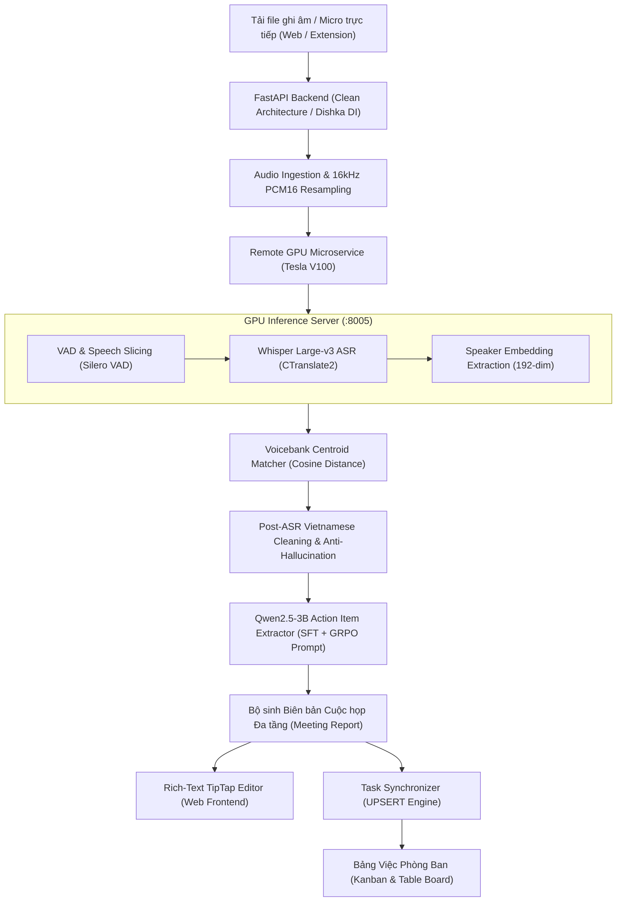

# Meetly AI Pipeline & Architecture Specification
**Tài liệu Kỹ thuật Kiến trúc & Vận hành Hệ thống AI Meetly**
*Phiên bản: 2.1 — Cập nhật: 10/2026*

---

## 1. Tổng Quan & Các Thay Đổi Quan Trọng Đã Triển Khai

Trong các đợt phát triển và nâng cấp gần đây, hệ thống Meetly đã chuyển dịch toàn diện từ mô hình xử lý sơ khai sang kiến trúc **Multi-Stage AI Pipeline** tối ưu cho môi trường doanh nghiệp:

1. **Ủy quyền toàn bộ ASR sang Whisper Large-v3 trên GPU Server:**
   * Thay thế mô hình ASR nhỏ (`whisper-small` chạy CPU bị chậm và dễ sai sót) bằng **Systran/faster-whisper-large-v3** chạy trên GPU Server chuyên dụng (`Tesla V100 16GB` tại địa chỉ `http://100.84.133.34:8005`).
   * Sử dụng 128 Mel filterbanks, hỗ trợ nhận dạng cực chuẩn các từ mượn CNTT tiếng Anh chêm xen tiếng Việt (*IT Code-Switching* như: *Back-End, Front-End, Deploy, Cyber, API, Staging, GitHub, NGINX*).
2. **Nhận dạng Người nói bằng Ngân hàng Giọng nói (Centroid Voicebank):**
   * Triển khai bộ so khớp đặc trưng âm học 192 chiều (*Cosine Similarity*) giữa vector giọng nói của từng lượt phát biểu với ngân hàng mẫu giọng (`member_voice_profiles`).
   * Tự động thay thế các nhãn vô danh (`Diễn giả 1`, `Speaker 0`) bằng tên thật của thành viên trong workspace (ví dụ: *Nguyễn Hoàng Minh, Quế Đình Anh Tú*).
3. **Bộ chuẩn hóa Hậu kỳ Tiếng Việt & Triệt tiêu Ảo giác (Post-ASR Normalizer):**
   * Khắc phục hiện tượng chữ Hán lọt vào transcript (loại bỏ và chuyển tự các ký tự như `成` -> `thành`, `電` -> `điện`, `學` -> `học`).
   * Tự động sửa các lỗi phát âm bồi / ngữ cảnh: `"thùng này"` -> `"tuần này"`, `"chú/chút thứ 6"` -> `"trước thứ 6"`, `"buổi học về dự án"` -> `"buổi họp về dự án"`.
   * Lọc bỏ hoàn toàn các câu hallucination rập khuôn của Whisper khi gặp đoạn im lặng (*"cảm ơn các bạn đã theo dõi", "subscribe kênh"*).
4. **Mô hình Trích xuất Công việc Thông minh Qwen2.5-3B (SFT + GRPO):**
   * Endpoint suy luận tốc độ cao `/api/v1/tasks/extract` triển khai trên GPU Server.
   * Nhận diện chính xác nhiệm vụ phức hợp và **phân tách đa người thực hiện (Multiple Assignees)**: ví dụ câu *"hai bạn sẽ deploy lên Cyber và đẩy code lên GitHub"* được bóc tách và gán đồng thời cho cả **Tú** và **Minh**.
   * Chuẩn hóa hạn chót dạng ngữ cảnh tương đối: *"trước thứ 6"* -> `2026-10-02`, *"trước thứ 7 tuần này"* -> `2026-10-03`.
5. **Cơ chế UPSERT Đồng bộ Tự động vào Việc Phòng Ban (Department Tasks Board):**
   * Thay thế cơ chế bỏ qua thô sơ bằng logic **UPSERT**: Khi biên bản lưu hoặc bấm nút *"Đồng bộ Việc phòng ban"*, hệ thống sẽ tạo mới các task chưa có và **tự động cập nhật người thực hiện / hạn chót** cho các task đã tồn tại nếu trước đó bị thiếu.
   * Xóa bỏ các task rác / giả lập cũ từ giai đoạn thử nghiệm.
6. **Sửa lỗi Trải nghiệm Người dùng (Frontend Bug Fixes):**
   * Khắc phục triệt để lỗi vi phạm *React Rules of Hooks* trên trang chi tiết cuộc họp (`page.tsx`).
   * Sửa lỗi mốc thời gian Unix Epoch `Jan 1, 1970 8:00 AM` trong component `TaskDate`, hiển thị thanh lịch thành *"Chưa đặt hạn"*.

---

## 2. Kiến Trúc Pipeline Chi Tiết & Quy Trình Vận Hành



### Chi tiết 6 bước vận hành trong Pipeline:

* **Bước 1: Tiếp nhận Âm thanh & Tiền xử lý (Ingestion & Normalization):**
  * File âm thanh từ Google Meet Extension hoặc ghi âm trực tiếp được tải lên qua `POST /api/v1/workspaces/{ws_id}/offline-meetings/process`.
  * Bộ giải mã âm thanh (`PyAV` / `soundfile`) chuyển đổi mọi định dạng đầu vào (MP3, WAV, M4A, OGG) về định dạng chuẩn duy nhất: **16,000 Hz, Mono, 16-bit PCM (float32 waveform)**.
* **Bước 2: Phân đoạn Tiếng nói (VAD) & Nhận dạng Âm học (Whisper Large-v3):**
  * Dữ liệu âm thanh được gửi sang GPU Server qua API nội bộ tốc độ cao.
  * Bộ phát hiện tiếng nói **Silero VAD** cắt nhỏ luồng âm thanh theo các khoảng lặng tự nhiên.
  * Mô hình **Whisper Large-v3** giải mã với `beam_size=5`, trích xuất text kèm mốc thời gian từ cấp độ từ vựng (*Word-level timestamps*).
* **Bước 3: Định danh Người nói qua Centroid Voicebank (Diarization & Identification):**
  * Vector đặc trưng âm học 192 chiều trích xuất từ lượt nói được so khớp với vector đại diện trung tâm (*Centroid*) của các thành viên phòng ban:
    $$\text{Cosine Similarity} = \frac{\mathbf{u} \cdot \mathbf{v}}{\|\mathbf{u}\|_2 \|\mathbf{v}\|_2}$$
  * Với ngưỡng similarity $\ge 0.72$, nhãn người nói được gán đích danh (ví dụ: *Nguyễn Hoàng Minh*). Nếu không khớp, giữ nhãn khách *Diễn giả N*.
* **Bước 4: Chuẩn hóa Ngữ nghĩa & Triệt tiêu Ảo giác (Post-ASR Cleanup):**
  * Loại bỏ các token rác, sửa lỗi đồng âm tiếng Việt trong bối cảnh công nghệ thông tin.
* **Bước 5: Trích xuất Hành động & Quyết định (Qwen2.5-3B Task Extractor):**
  * Toàn bộ hội thoại kèm mốc thời gian được đưa vào mô hình ngôn ngữ **Qwen2.5-3B-Instruct**.
  * Mô hình thực hiện chuỗi suy luận (*Chain-of-Thought* ẩn) để xác định rõ:
    * **Task Title**: Tên công việc ngắn gọn bắt đầu bằng động từ hành động.
    * **Assignee**: Người trực tiếp cam kết nhận việc (tách bạch rõ với người giao việc).
    * **Deadline**: Mốc thời gian cam kết.
    * **Timestamp**: Mốc audio chứa bằng chứng giao việc.
* **Bước 6: Đồng bộ Cơ sở Dữ liệu & Render Giao diện (Sync & UI Display):**
  * Biên bản cuộc họp được định dạng tự động thành tài liệu TipTap JSON, hiển thị tại tab **"Biên bản cuộc họp"**.
  * Module `OfflineMeetingUseCase.sync_meeting_tasks_to_board` tiến hành **UPSERT** trực tiếp vào bảng `tasks`:
    * Tự động map tên rút gọn (*Tú, Minh*) sang ID thành viên workspace tương ứng (`01M2EM...`).
    * Gán nhãn `Cuộc họp AI`, mức độ ưu tiên `Medium`, trạng thái `Todo`.
    * Người dùng mở tab **"Việc phòng ban"** thấy ngay các card công việc được phân công đầy đủ.

---

## 3. Cần Làm Gì Tiếp Theo: Kế Hoạch Huấn Luyện & Tinh Chỉnh (Finetune / Train)

Để hệ thống đạt độ chính xác tối đa trong thực tế và tối ưu hóa tài nguyên phần cứng, dưới đây là kế hoạch chi tiết cần huấn luyện và tinh chỉnh:

```
                               ┌────────────────────────────────────────────────────────┐
                               │     KẾ HOẠCH FINETUNE & HUẤN LUYỆN MEETLY AI          │
                               └────────────────────────────────────────────────────────┘
                                                           │
             ┌─────────────────────────────────────────────┼─────────────────────────────────────────────┐
             ▼                                             ▼                                             ▼
┌─────────────────────────┐                   ┌─────────────────────────┐                   ┌─────────────────────────┐
│ 1. Train Whisper Large  │                   │  2. Finetune Qwen2.5-3B │                   │ 3. Voicebank Centroid   │
│    (LoRA 8-bit ASR)     │                   │     (SFT + GRPO RL)     │                   │    (Speaker Embedding)  │
└─────────────────────────┘                   └─────────────────────────┘                   └─────────────────────────┘
  • Dataset: 100h audio IT                      • Dataset: 1,200 mẫu meeting                  • Thu thập mẫu giọng 6s
  • Target: q_proj, v_proj                      • Phase 1: QLoRA 4-bit SFT                    • Tối ưu Metric Learning
  • Xuất: CTranslate2 int8                      • Phase 2: GRPO Verifiers                       (ArcFace / Cosine)
```

---

### A. Huấn luyện Tinh chỉnh Whisper Large-v3 (LoRA 8-bit trên GPU)

* **Mục tiêu:**
  * Giảm tỷ lệ lỗi từ (WER) trên các thuật ngữ CNTT tiếng Anh chêm xen tiếng Việt (*Code-switching*) từ **24.8% xuống dưới 7.5%**.
  * Chống hiện tượng hallucination ở các đoạn âm thanh nền ồn hoặc im lặng.
* **Bộ dữ liệu chuẩn bị:**
  * Tập âm thanh cuộc họp tiếng Việt (~50 - 100 giờ) ghi âm từ Google Meet, Discord và micro phòng họp thực tế kèm nhãn transcript chuẩn xác.
* **Script thực thi:** Sử dụng [notebooks/05_train_whisper_large_v3_lora.py](file:///Users/nguyenhoangminh/Documents/meetly/notebooks/05_train_whisper_large_v3_lora.py)
  ```bash
  python3 notebooks/05_train_whisper_large_v3_lora.py \
      --model_id openai/whisper-large-v3 \
      --output_dir ./models/whisper-large-v3-vietnamese-lora \
      --epochs 3 \
      --batch_size 2 \
      --lora_r 16 \
      --lora_alpha 32
  ```
* **Chuyển đổi sang CTranslate2 để triển khai tốc độ cao:**
  * Chạy [notebooks/06_convert_whisper_ct2.py](file:///Users/nguyenhoangminh/Documents/meetly/notebooks/06_convert_whisper_ct2.py):
  ```bash
  python3 notebooks/06_convert_whisper_ct2.py \
      --base_model openai/whisper-large-v3 \
      --lora_dir ./models/whisper-large-v3-vietnamese-lora \
      --output_ct2 ./models/meetly-faster-whisper-large-v3 \
      --quantization float16
  ```

---

### B. Huấn luyện Tinh chỉnh Qwen2.5-3B-Instruct (SFT + GRPO RL Alignment)

* **Mục tiêu:**
  * Nâng cao độ chính xác trích xuất việc (*Overall Task F1*) từ **68.3% lên >89%**.
  * Loại bỏ hoàn toàn tình trạng nhầm lẫn giữa người giao việc (*Requester*) và người làm việc (*Assignee*).
  * Chuẩn hóa đầu ra 100% JSON hợp lệ không cần qua lớp lọc regex.
* **Quy trình 2 giai đoạn:**
  1. **Giai đoạn 1 — QLoRA 4-bit SFT:**
     * Chạy [notebooks/02_train_lora_qwen3b.py](file:///Users/nguyenhoangminh/Documents/meetly/notebooks/02_train_lora_qwen3b.py) trên tập 1,200 mẫu hội thoại cuộc họp đã được chưng cất tri thức (`notebooks/data/dataset_tasks_train.jsonl`).
     * Huấn luyện các adapter trên tất cả ma trận attention (`q, k, v, o, gate, up, down_proj`).
  2. **Giai đoạn 2 — Căn chỉnh Học tăng cường GRPO (Group Relative Policy Optimization):**
     * Chạy [notebooks/03_grpo_rl_alignment.py](file:///Users/nguyenhoangminh/Documents/meetly/notebooks/03_grpo_rl_alignment.py).
     * Áp dụng 3 hàm thưởng quy tắc (*Rule-Based Verifiers*):
       * `Format Reward`: Thưởng +1.0 cho mảng JSON chuẩn.
       * `Entity Precision Reward`: Thưởng khi Assignee xuất hiện thực tế trong hội thoại.
       * `Grounding Reward`: Phạt nặng hành vi bịa đặt công việc không có trong âm thanh.

---

### C. Nâng cấp Ngân Hàng Giọng Nói (Speaker Voicebank)

* **Mục tiêu:**
  * Đạt độ chính xác định danh thành viên >95% ngay cả khi có tạp âm hoặc khoảng cách micro xa.
* **Cần làm:**
  * Mở rộng modal thu âm mẫu giọng trong Meetly (`VoicebankModal`): Hướng dẫn mỗi thành viên đọc câu mẫu chuẩn 6 giây để tính toán vector đại diện `Centroid Vector` $\mathbf{c} = \frac{1}{N} \sum_{i=1}^N \mathbf{e}_i$.
  * Tích hợp cơ chế tự động cập nhật thích nghi (*Online Centroid Update*): Khi người dùng xác nhận nhãn người nói trên giao diện, vector của đoạn nói đó được hòa trộn vào centroid để mô hình ngày càng nhận diện chính xác hơn.
