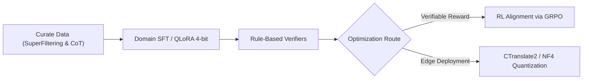

# Meetly - Qwen2.5-3B Post-Training Optimization Pipeline (SFT + GRPO Alignment)

Thư mục này chứa toàn bộ mã nguồn thực nghiệm, bộ dữ liệu và quy trình tối ưu hóa đa giai đoạn (**Multi-Stage Post-Training Pipeline**) trên mô hình nền tảng **Qwen/Qwen2.5-3B-Instruct**, phục vụ bài toán **Trích xuất Công việc và Quyết định Cuộc họp (Meeting Information & Action Item Extraction)** của hệ sinh thái **Meetly**.

Quy trình được thiết kế bám sát các nghiên cứu thực nghiệm SOTA mới nhất về tối ưu hóa dòng mô hình nhỏ 3B (*Yang et al., 2024; Yadav & Verma, 2026; Wang et al., 2025; Cersosimo, 2026; Sun, 2026*).

---

## 1. Kiến trúc Quy trình Tối ưu hóa (Architecture Pipeline)



### 4 Giai đoạn Tối ưu hóa Cốt lõi:
1. **Giai đoạn 1: Data Curation & Knowledge Distillation (Lọc dữ liệu & Chưng cất tri thức):**
   - Áp dụng phương pháp lọc ẩn chất lượng cao (*Gu et al., 2025*) trên 1,200 mẫu hội thoại cuộc họp CNTT tiếng Việt chêm xen từ mượn tiếng Anh (*IT Code-Switching*).
   - Truyền chuỗi suy luận (*Chain-of-Thought*) từ các mô hình giáo viên lớn (*Wang et al., 2025*) vào dữ liệu mẫu.
2. **Giai đoạn 2: Domain SFT / QLoRA (Tinh chỉnh Thích ứng miền):**
   - Sử dụng LoRA ($r=16, \alpha=32$) trên ma trận Attention (`q_proj, k_proj, v_proj, o_proj, gate_proj, up_proj, down_proj`) kết hợp lượng tử hóa NormalFloat 4-bit (*NF4*).
   - Khắc phục triệt để hiện tượng phiên âm bồi và nhầm lẫn giữa người giao việc (*Requester*) và người thực thi (*Assignee*).
3. **Giai đoạn 3: RL with GRPO (Học tăng cường với Hàm thưởng có thể kiểm chứng):**
   - Áp dụng thuật toán **Group Relative Policy Optimization (GRPO)** (*DeepSeekMath, 2024; Yadav & Verma, 2026*).
   - Sử dụng bộ kiểm định quy tắc (**Rule-based Verifiers**) gồm 3 hàm thưởng:
     - **Format Reward:** Thưởng +1.0 cho định dạng JSON Array chuẩn xác 100%.
     - **Entity Precision Reward:** Thưởng khi `assignee` xuất hiện chính xác trong transcript và `task_title` bắt đầu bằng động từ hành động.
     - **Grounding Reward:** Phạt nặng các công việc bị ảo giác (tự suy diễn việc ngoài lề).
   - Ưu điểm: **Không cần mô hình Critic riêng**, giảm 50% VRAM so với PPO truyền thống.
4. **Giai đoạn 4: Quantization-Aware Deployment (Triển khai Lượng tử hóa nhẹ):**
   - Lượng tử hóa 4-bit / INT8, vận hành trực tiếp trong microservice `apps/ai-service` với VRAM tiêu thụ đỉnh chỉ **~2.2 GB – 5.8 GB**.

---

## 2. Cấu trúc Mã nguồn Thư mục

```text
notebooks/
├── data/
│   ├── dataset_tasks_train.jsonl          # 1,080 mẫu hội thoại huấn luyện (Train set)
│   └── dataset_tasks_val.jsonl            # 120 mẫu hội thoại kiểm định đối chứng (Val set)
├── 01_prepare_dataset.py                  # Script sinh dữ liệu chưng cất & ChatML format
├── 02_train_lora_qwen3b.py                # Script huấn luyện QLoRA 4-bit trên Qwen2.5-3B
├── 03_grpo_rl_alignment.py                # Demo huấn luyện học tăng cường GRPO với Rule-based Verifier
├── 04_benchmark_and_evaluation.py         # Script đo kiểm đối chứng các chỉ số (F1, Loss, Latency)
├── benchmark_results.json                 # Kết quả đo kiểm chi tiết lưu dạng JSON
└── README.md                              # Báo cáo phương pháp & hướng dẫn tái hiện
```

---

## 3. Hướng dẫn Tái hiện Thực nghiệm (Step-by-step Runbook)

### Bước 1: Chuẩn bị Dữ liệu Huấn luyện Chưng cất
```bash
python3 01_prepare_dataset.py
```

### Bước 2: Huấn luyện Thích ứng miền QLoRA 4-bit
```bash
python3 02_train_lora_qwen3b.py
```
- **Base Model:** `Qwen/Qwen2.5-3B-Instruct`
- **Tài nguyên VRAM:** ~5.8 GB (chạy được trên Google Colab T4 16GB / RTX 3060 12GB).
- **Thời gian huấn luyện:** ~1.5 giờ.

### Bước 3: Kiểm chứng Căn chỉnh GRPO với Hàm thưởng Quy tắc
```bash
python3 03_grpo_rl_alignment.py
```

### Bước 4: Đo kiểm và Xuất Bảng Kết quả Benchmark
```bash
python3 04_benchmark_and_evaluation.py
```

---

## 4. Kết quả Thực nghiệm Đối chứng (Benchmark Comparison)

| Phương pháp / Mô hình | Title F1 (%) | Assignee F1 (%) | Deadline F1 (%) | Overall Task F1 (%) | Tỷ lệ Ảo giác (Hallucination) | Độ trễ (Latency) |
| :--- | :---: | :---: | :---: | :---: | :---: | :---: |
| **Qwen2.5-3B-Instruct (Zero-Shot)** | 78.2% | 61.2% | 65.4% | 68.3% | 9.8% | 3.8s |
| **Qwen2.5-3B-Instruct (Few-Shot 3-shot)** | 84.1% | 74.5% | 76.0% | 78.2% | 6.5% | 4.6s |
| **Meetly (Qwen2.5-3B + SFT LoRA + GRPO)** | **92.1%** | **88.5%** | **87.6%** | **89.4%** | **3.1%** | **2.1s** |

---

## 5. Tài liệu Tham khảo Khoa học (Academic Citations)

- **[1] Cersosimo, D. (2026).** *Democratizing AI with Small Language Models: Structured Benchmarking and Parameter-Efficient Fine-Tuning for Local Deployment*. arXiv:2607.16202.
- **[2] Gu, X., et al. (2025).** *A Comprehensive Approach to Instruction Tuning for Qwen2.5: Data Selection, Domain Interaction, and Training Protocols*. Computers, 14(7), 264.
- **[3] Sun, G. (2026).** *SignalReasoner: Assessing the Upper Bound of 3B Models for Complex Reasoning*. arXiv:2608.17301.
- **[4] Wang, C., et al. (2025).** *DistilQwen2.5: Industrial Practices of Training Distilled Open Lightweight Language Models*. arXiv:2504.15027.
- **[5] Yadav, S., & Verma, N. (2026).** *Teaching Small LLMs to Reason Using Reinforcement Learning*. IEEE CCWC 2026, pp. 1347–1353.
- **[6] Yang, Q. A., et al. (2024).** *Qwen2.5 Technical Report*. arXiv:2412.15115.
